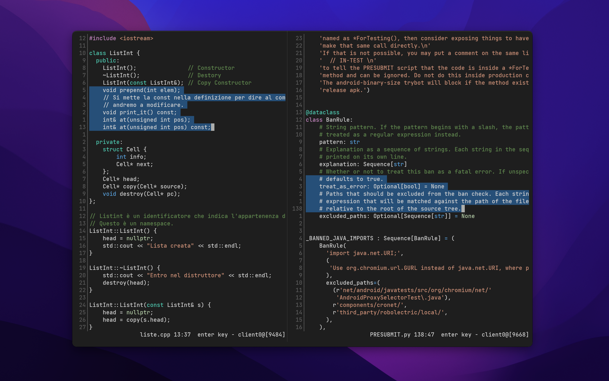

== kak Codedark

kak Codedark is a port of
https://github.com/tomasiser/vim-code-dark[vim-code-dark] theme for the
https://kakoune.org/[kakoune] text editor.

== Installation

For the installation, just curl the file in your kakoune's config:
[,shell]
----
mkdir -p ~/.config/kak/colors/
curl https://raw.githubusercontent.com/saccarosium/kak-codedark/main/colors/codedark.kak -o ~/.config/kak/colors/codedark.kak
----

Alternatively you can use plug.kak:
[,kak]
----
plug "saccarosium/kak-codedark" theme
----

== Credits

* https://github.com/tomasiser/vim-code-dark[vim-code-dark]: all the colors are taken from here;
* https://git.sr.ht/~raiguard/one.kak[one.kak]: for giving me a starter file to build on.
